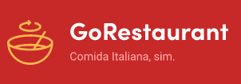
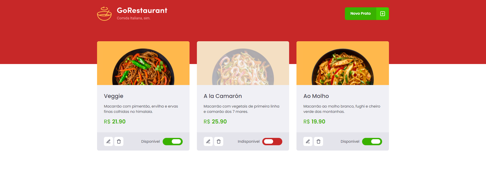

<h1 align="center">
  
</h1>

<h1>
  
</h1>

# Indice

- [Sobre](#-sobre)
- [Tecnologias utilizadas](#-tecnologias-utilizadas)
- [Como baixar o projeto](#-como-baixar-o-projeto)
---

## 🧾Sobre

O Projeto **GoRestaurant** é sistema para delivery de um restaurante de comida Italiana. A versão **Web** tem a função de controlar os pratos disponiveis, adicionar novos pratos e remover caso necessário.

Projeto realizado durante o **Bootcamp GoStack** da Rocketseat.

---

## 🛠Tecnologias utilizadas

O Projeto foi desenvolvido utilizando as seguintes tecnologias

- [Reactjs](https://reactjs.org)
- Axios
- Typescript
- Styled-components

---

## 🏴‍☠️ Utilizando uma Fake API
Para testar a aplicação web você pode estar utilizando uma fake API, para isso o projeto possui uma dependência chamada json-server, e um arquivo chamado server.json que contém os dados para uma rota /foods. Para executar esse servidor você pode executar o seguinte comando:

```bash
yarn json-server server.json -p 3333
```

---
## 💾 Como baixar o projeto

### Web

```bash

# Clonar o Repositório
$ git clone https://github.com/ArielCrivellaro/GoRestaurant-Web.git

# Entrar no Repositório
$ cd GoRestaurant-Web

# Instalar as dependências
$ yarn install

# Iniciar o Projeto
$ yarn start

```

### App

#### [GoRestaurant - Mobile](https://github.com/ArielCrivellaro/GoRestaurant-mobile)

### 🚧 API Node
Em construção

---

### Desenvolvido por 😎 Ariel Crivellaro Martins
